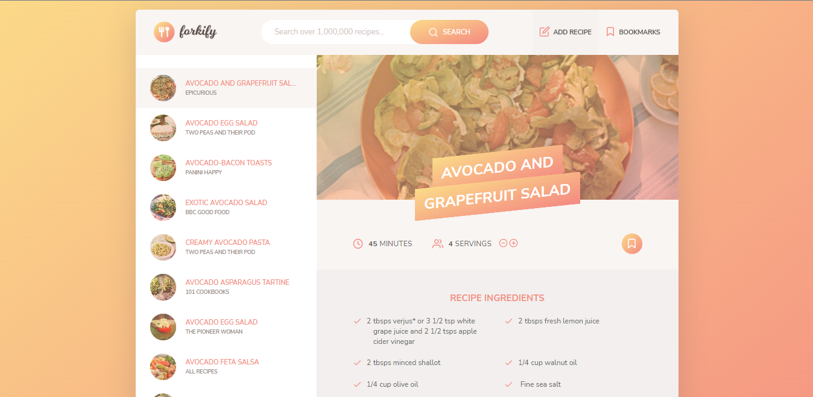

# Forkify - Your One-Stop Recipe Application

Forkify is the ultimate recipe application that allows you to access over 100,000 recipes from around the world, and even upload your own recipes to to your own account. With Forkify, you can easily search different kinds of recipes with ingredients, step-by-step instructions, and cooking time, so you can find the perfect recipe for any occasion.

## Features:

- **Search**: Search for recipes based on recipe name. You can even filter your search results by cooking time, cuisine type, and more.

- **Custom Recipe Upload**: Have a recipe that you'd like to share with others? Upload your own custom recipe and share it with the Forkify community.

- **Ingredients & Details**: Get all the details you need about a recipe, including ingredients, cooking time, and step-by-step instructions. You can even view nutritional information and ratings from other users.

- **Servings Adjustment**: Easily adjust the servings of a recipe and watch as the ingredient quantities update automatically.

Forkify is the perfect application for anyone who loves to cook or wants to explore new recipes. Whether you're a seasoned chef or a beginner, Forkify has everything you need to create delicious meals in your own kitchen. So what are you waiting for? Start exploring Forkify today!

